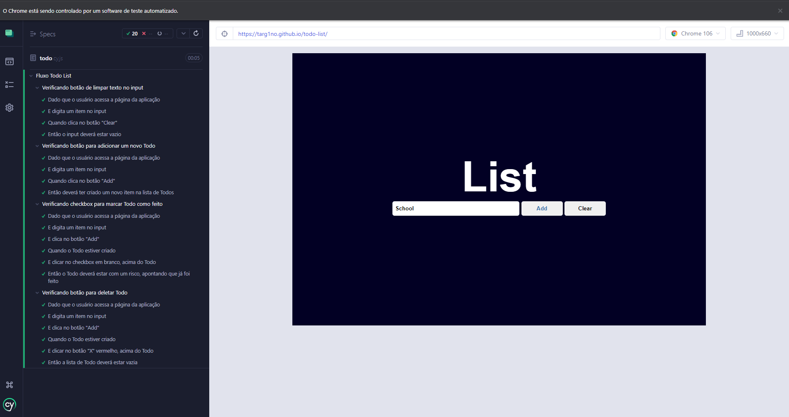
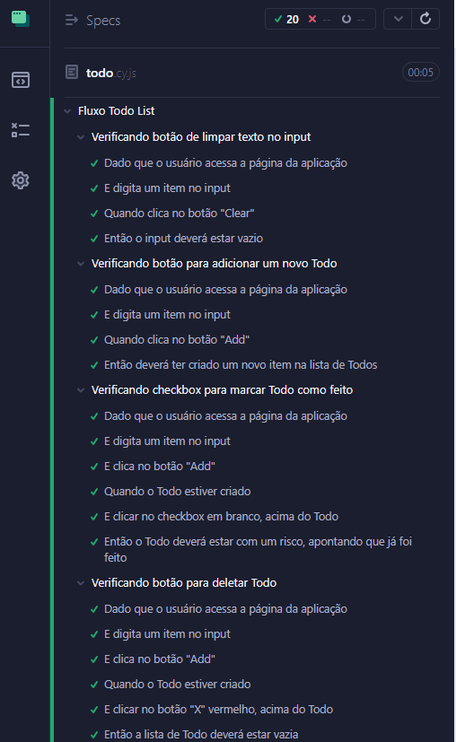

# To do List

Uma lista de "Todos", tendo como finalidade colocar conhecimento em JS, BDD e Cypress na prática.

## Status

- Em desenvolvimento

## Authors

- [Walbert Chaves](https://github.com/walbinh0)


## Deployment

Para depoloyar esse projeto, copie o link abaixo e cole na barra de url do browser:

- [Todo List](https://github.com/walbinh0/todo_list)


## Demo Application


## Features

- Limpa o input
- Adiciona um item
- Deleta um item
- Checa um item


## Run Locally

Faça o clone do projeto

```bash
  git clone https://github.com/walbinh0/todo_list.git
```

Vá para o diretório dele

```bash
  cd todo-list
```

Instale as dependências dos testes

```bash
  npm install
```

Instale a extensão do Live Server (vsCode) e rode o comando abaixo

```bash
  open with Live Server
```

## Running Tests

Para executar os testes, siga os seguintes comandos:
(Verifique se tem o NodeJs instalado na sua máquina antes de dar continuidade)

```bash
  npx cypress run
```

## BDD Structure Screenshot 


- 

- 


## Feedback

Se você tem algum feedback, por favor, entre em contato comigo pelo endereço de e-mail a seguir: walbertchaves12@gmail.com


## 🔗 Links
[](https://www.linkedin.com/in/walbinh0/)


## 🛠 Skills
Cypress, Mocha, Chai, Bdd, Javascript, HTML, CSS...

